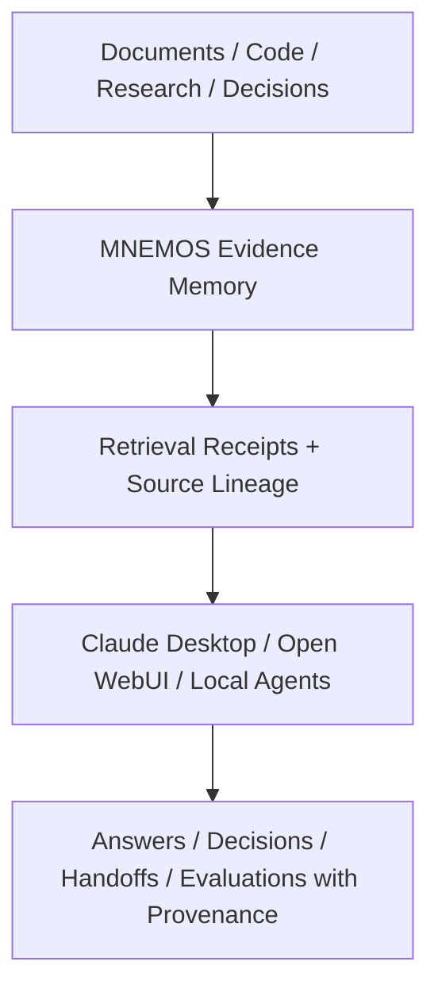
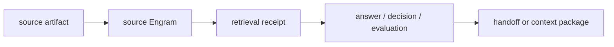

<div align="center">

# MNEMOS

**Source-grounded evidence memory for AI workflows.**

MNEMOS is a source-grounded evidence memory layer for AI workflows where the
system must prove what evidence shaped an answer, decision, handoff, or
evaluation.

[Quickstart](#quickstart-run-mnemos-locally) |
[Architecture](#architecture) |
[Capability Status](#capability-status) |
[Examples](#examples-and-integrations) |
[Evidence](#evidence-and-evaluation-status) |
[Research Ledger](#research-ledger) |
[Limitations](#what-mnemos-is-not) |
[Contributing](#contributing-and-project-boundaries)

</div>

## What MNEMOS Is

MNEMOS is for AI workflows that need more than "the model found something
similar." It preserves source lineage, retrieval metadata, evidence summaries,
and governance boundaries so a downstream agent, chat UI, evaluator, or human
operator can inspect why specific context was used.

Many systems help agents retrieve or remember more context. MNEMOS focuses on
whether the system can show what evidence shaped an answer, decision, handoff,
or evaluation.

Use MNEMOS when you need:

- source-grounded retrieval over local documents, code, research, and decisions;
- citation-ready evidence in search responses;
- audit and provenance records for memory operations;
- explicit boundaries between runtime features, experimental opt-ins, and
  research-only work;
- local integration with Claude Desktop, Open WebUI, Ollama, MCP, or other
  agents through documented APIs.

MNEMOS is a developer preview. It is not a broad production-readiness claim.

## How It Fits



Traceability is the public differentiator:



These diagrams describe the supported evidence-memory path. Context graph projection remains preregistered research only and is not a runtime feature.

## Quickstart: Run MNEMOS Locally

Prerequisites:

- Docker and Docker Compose
- Python 3.10+
- NVIDIA Container Toolkit for the checked-in GPU-oriented default Compose file

Clone and start the default local stack:

```bash
git clone https://github.com/ro0TuX777/MNEMOSv2.git
cd MNEMOSv2
python -m pip install -r requirements.txt
docker compose up -d --build
```

The default Compose file uses fixed container names such as
`mnemos-service`, `mnemos-qdrant`, and `mnemos-postgres`. If another MNEMOS
stack is already running on the same host, stop that stack before starting a
fresh clone, or use the installer-generated Compose file for a separate local
profile.

Check health:

```bash
curl http://localhost:8700/health
curl http://localhost:8700/v1/mnemos/capabilities
```

Index one verification record and search for it:

These examples use bash-compatible quoting. On Windows PowerShell, run them
from Git Bash or WSL, or translate the JSON quoting to `Invoke-RestMethod`.

```bash
curl -X POST http://localhost:8700/v1/mnemos/index \
  -H "Content-Type: application/json" \
  -d '{"documents":[{"content":"MNEMOS quickstart verification record","source":"docs:quickstart","neuro_tags":["docs","quickstart"]}]}'

curl -X POST http://localhost:8700/v1/mnemos/search \
  -H "Content-Type: application/json" \
  -d '{"query":"quickstart verification record","top_k":1}'
```

If you do not have NVIDIA container support, use the installer to generate a
host-appropriate Compose file before starting the stack:

```bash
python -m installer
docker compose -f docker-compose.generated.yml up -d --build
```

For full installation details, deployment profiles, and troubleshooting, see
[INSTALL.md](INSTALL.md) and [deployment profiles](docs/deployment_profiles.md).

## What It Can Do Today

MNEMOS currently supports a core source-grounded retrieval path, evidence-rich
search responses, local REST and SDK integration, deployment profiles, and an
audit ledger for memory operations. Optional and research lanes are deliberately
kept separate from the default runtime path.

The shortest working path is:

```text
source artifact -> MNEMOS index/search -> evidence summary -> downstream answer
```

The richer local-chat path is:

```text
research files -> MNEMOS intake -> MNEMOS retrieval -> Ollama -> Open WebUI
```

See [chat integration evidence contract](docs/chat_integration_evidence_contract.md)
for the citation shape returned by search.

## Capability Status

This table is a public status summary. The maintained boundary is
[docs/support_matrix.md](docs/support_matrix.md).

| Capability | Current status | Notes |
| --- | --- | --- |
| Source-grounded retrieval | Available | Default semantic retrieval through the REST API and supported deployment profiles. |
| Evidence summaries / provenance | Available | Search responses expose per-result evidence and grouped source summaries for citation-aware consumers. |
| REST API and Boundary SDK | Available | Health, capabilities, index, search, lookup, audit, stats, and warmup are documented integration surfaces. |
| MCP integration | Available for local use | Claude Desktop MCP setup and smoke tests are documented. |
| Open WebUI / Ollama local chat | Available R0 context path | Retrieves MNEMOS evidence and returns local evidence receipts; it does not alter retrieval policy. |
| Forensic audit ledger | Available | PostgreSQL-backed audit is preferred in deployed profiles; SQLite fallback exists for local use. |
| Research intake / OCR fallback | Available where configured | The local intake workflow supports PDFs and other artifacts; large or scanned files may require operator tuning. |
| Semantic / hybrid retrieval mode | Beta / pilot | Semantic remains default. Hybrid is for targeted evaluation where exact-term failures are suspected. |
| Governance advisory / enforced modes | Beta / pilot | Governance can score, explain, and optionally suppress candidates when explicitly enabled; thresholds are corpus-dependent. |
| Associative candidate expansion | Experimental opt-in | Associative Routing E2 is disabled by default and can append bounded, source-linked candidates for selected query classes. |
| Evidence Admission R0 shadow | Research / shadow | Read-only observability path; default served retrieval is unchanged. |
| Evidence Admission R1 enforcement | Not retained | Formal non-inferiority failed, so positive retention claims are blocked. |
| EBIR refinement | Experimental / shadow | Offline evidence refinement; authoritative promotion remains blocked. |
| Context graph projection | Research-only preregistered | No implementation or runtime promotion is authorized. |
| Context Atlas / Associative Retrieval A1 | Research / spec only | Design and benchmark lanes only. |
| ColBERT / reranker production path | Blocked | No production relevance claim until gates justify promotion. |
| Production readiness | Developer preview | Use documented profiles and evidence artifacts; do not treat research lanes as product guarantees. |

## Architecture

MNEMOS separates source evidence, retrieval, governance evaluation, and consumer
context assembly:

```text
Sources, records, and project artifacts
        ->
Engrams with source metadata
        ->
Semantic / hybrid candidate retrieval
        ->
Evidence summaries, audit, and optional governance checks
        ->
Bounded context for AI applications or operators
```

A retrieved item is not automatically true, current, permitted, or suitable to
influence an action. MNEMOS preserves the evidence and boundaries needed for
the downstream workflow to make that judgment.

Start with the concise [architecture guide](docs/architecture.md), then use the
[documentation index](docs/README.md), [whitepaper](docs/whitepaper.md), and
[ADR index](docs/adr/README.md) for deeper design history.

## Examples And Integrations

- [Claude Desktop MCP setup](docs/integrations/claude_desktop_mnemos_mcp.md)
  exposes MNEMOS as local MCP tools.
- [Open WebUI local chat](docs/integrations/openwebui_mnemos_local_chat_readme.md)
  shows the end-to-end research chat path.
- [Ollama MFS adapter](docs/integrations/ollama_mnemos_mfs.md) retrieves MNEMOS
  evidence through the SDK/API boundary and sends bounded context to Ollama.
- [Chat evidence contract](docs/chat_integration_evidence_contract.md) defines
  how integrations should preserve citations, ranks, scores, and source fields.

Complementary tools can still do what they are good at:

- Open WebUI can be the interface.
- Qdrant or pgvector can be the retrieval store.
- MCP can be the bridge.
- Local models can be the generator.
- MNEMOS is the evidence-memory layer that keeps the work traceable.

## Evidence And Evaluation Status

MNEMOS keeps benchmark, evaluation, and closeout artifacts in the repository so
claims can be inspected instead of inferred.

What has passed:

- default Core Memory Appliance and Governance Native profile generation and
  validation are documented in [INSTALL.md](INSTALL.md),
  [deployment profiles](docs/deployment_profiles.md), and
  [benchmark results](docs/benchmark.md);
- the REST search path exposes citation-ready evidence objects documented in
  [chat integration evidence contract](docs/chat_integration_evidence_contract.md);
- Evidence Admission R0 shadow and R1 gate-off runs preserved served retrieval
  output in the formal R1 evaluation.

What remains experimental:

- hybrid retrieval is available for targeted pilots, but semantic retrieval
  remains the broad default;
- governance advisory/enforced modes require corpus-specific threshold and
  failure-mode validation;
- Associative Routing E2 is an opt-in candidate-expansion mechanism with
  limited positive evidence for selected query classes only;
- EBIR and derived-facts lanes remain shadow or bounded evaluation paths.

What failed and was not retained:

- Evidence Admission and Budgeting R1 enforcement failed the preregistered
  primary non-inferiority criterion and is not retained for positive runtime
  claims. See
  [R1 closeout](docs/evidence_admission_and_budgeting_r1_closeout.md).
- Gate C hybrid did not justify a global hybrid default in its recorded
  real-corpus decision. Semantic remains default.

What is research-only:

- context graph projection is preregistered research only;
- Context Atlas P0 and Associative Retrieval A1 are design or benchmark lanes;
- research-only lanes do not change default retrieval, governance, promotion,
  context assembly, Engram schema, or authority boundaries.

Use [benchmark results](docs/benchmark.md) for methodology and current evidence.
Do not treat internal trials as broad production, security, or productivity
claims unless the linked artifact explicitly supports that claim.

## How MNEMOS Is Different

Context databases, agent memory systems, RAG frameworks, vector databases, AI
IDE memory files, and local document chat tools can all help retrieve or reuse
context. MNEMOS is narrower: it is concerned with whether retrieved context can
be traced back to source evidence and reviewed as part of an answer, decision,
handoff, or evaluation.

MNEMOS is best understood as an evidence-memory layer around AI work, not as a
replacement for every retrieval framework or chat interface.

## What MNEMOS Is Not

- MNEMOS is not a generic vector database.
- MNEMOS is not a replacement for every RAG framework.
- MNEMOS is not a graph database.
- MNEMOS is not GraphRAG.
- MNEMOS is not an automatic authority engine.
- MNEMOS does not treat every retrieved memory as truth.
- MNEMOS does not promote research-only lanes into runtime behavior without
  review and evidence.
- MNEMOS does not claim broad production readiness from shadow, local, or
  research evaluations.

## Research Ledger

The research history is intentionally public. Failed, blocked, shadow-only, and
spec-only work is retained as part of the evidence discipline.

Start here:

- [Support matrix](docs/support_matrix.md)
- [Benchmark results](docs/benchmark.md)
- [ADR index](docs/adr/README.md)
- [Research and experimental lanes index](docs/README.md#research-and-experimental-lanes)
- [Context graph projection R1 preregistration](docs/experiments/context_graph_projection_r1_preregistration.md)

## Contributing And Project Boundaries

Contributions are welcome around reproducible benchmarks, deployment
reliability, documentation, source-grounded retrieval evaluation, provenance,
lifecycle management, and evidence-backed context operations.

Changes that affect retrieval ranking, candidate selection, governance,
authority, disclosure, promotion, deletion, downstream influence, or Engram
schema must include explicit tests and evidence artifacts.

MNEMOS is intended to support bounded AI workflows. Contributions should
preserve the separation between context retrieval, governance evaluation,
consumer decision-making, and action execution.

This repository currently declares a proprietary license posture.
