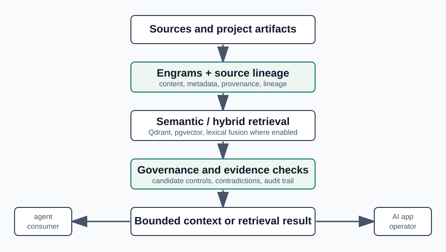

# MNEMOS Architecture Overview

MNEMOS provides a governed context layer for AI-native applications.

Its purpose is not merely to store memories or return semantically related records. It preserves the separation between source evidence, candidate retrieval, governance evaluation, and the bounded context that a downstream application, operator, or agent may consume.

This architecture supports a maintainable operating environment around AI systems: context can be traced to sources, evaluated against boundaries, inspected after use, and refreshed or retired as underlying information changes.

## Architectural Principle

A retrieved result is not automatically a decision, authorization, or action.

MNEMOS can provide source-grounded candidates, provenance, evaluation signals, and audit evidence. The downstream consumer remains responsible for applying its own workflow, permissions, review gates, and execution controls.

The whitepaper remains the detailed technical reference: [docs/whitepaper.md](whitepaper.md).

## System Flow

```text
Sources, records, and project artifacts
                  ↓
      Engrams + source lineage
                  ↓
 Semantic / hybrid candidate retrieval
                  ↓
 Governance, lifecycle, and evidence checks
                  ↓
 Bounded, inspectable working context
                  ↓
 AI application, operator, or agent workflow
```



## Primary Components

| Component | Role |
| --- | --- |
| MNEMOS service | Flask REST API exposing health, capabilities, index, search, audit, stats, and warmup endpoints. |
| Engram model | Stores content, metadata, source, tags, confidence, and lineage-ready fields. |
| Retrieval tiers | Qdrant and pgvector-backed retrieval profiles, with semantic and configurable hybrid modes. |
| Governance layer | Candidate evaluation, contradiction handling, lifecycle controls, and optional advisory/enforced read-path behavior. |
| Forensic ledger | Auditable records for index, search, mutation, and operational events. |
| Boundary SDK | Python client for readiness, retry, timeout handling, and typed index/search calls. |

## Deployment Shape

The default checked-in local stack is Docker Compose:

- `mnemos` service on port `8700`
- Qdrant on port `6333`
- PostgreSQL on port `5432`

Named deployment profiles and optional components are documented in [deployment profiles](deployment_profiles.md). Operational rollout, rollback, and incident handling are documented in the [operator playbook](mnemos_operator_playbook.md).

## Boundary Rules

- Source evidence, candidate retrieval, governance evaluation, and context assembly are separate concerns.
- Research lanes do not change default retrieval, governance, authority, disclosure, promotion, or deletion behavior unless explicitly enabled and independently evaluated.
- Experimental or shadow results are not production-readiness, security, or broad performance claims unless the linked evidence artifact says so.

For the public status boundary, see the [support matrix](support_matrix.md). For decision history, see the [ADR index](adr/README.md).
